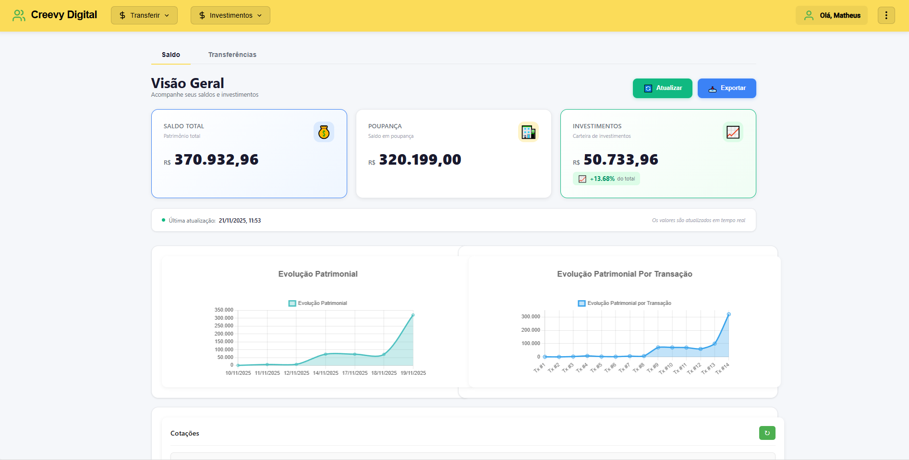
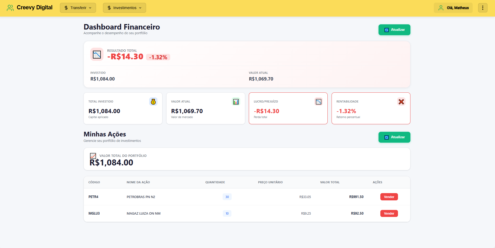
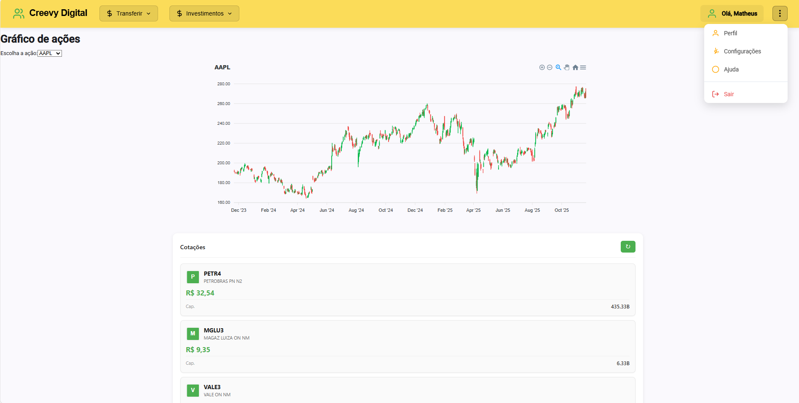
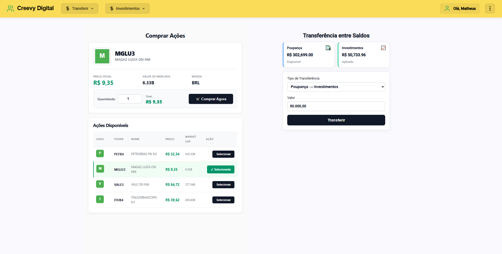

# Introdução

Aplicação Full-Stack com Spring-Framework + Angular + PostgreSQL + Docker que simula um banco digital com operações bancárias + integração com dados financeiros via Websocket.

# 1.0 Features do projeto

- Autenticação de usuários com JWT + Auth-Guard
- Múltiplos usuários ativos
- Transferências em entre contas de usuários
- Extrato bancário
- Gráficos de evolução patrimonial
- Compra/venda de ações
- Integração com API de cotações e dados financeiros (Brapi.dev)
- Integração com API de dados históricos de cotações (Massive.com)
- Plotagem de gráficos históricos com ApexCharts
- Dashboard de rentabilidade de portfólio

# 2.0 Stack de tecnologias

- Java Spring Framework (JPA, Security, JWT)
- PostgreSQL (DB Relacional)
- Interfaces de usuário com Angular
- Orquestração de containers (Docker-compose)
- Provisionamento de máquinas virtuais locais com Vagrant

# 3.0 Componentes

## 3.1 Front-end - Angular 20.3.8

- Autenticação de páginas com Auth-guard
- Plotagem de gráficos com dados armazenados no DB com ng2-charts
- Plotagem de gráficos de dados históricos de cotações com apex-charts

## 3.2 Back-end - Spring-boot 3.5.7

- Padrão arquitetural de aplicação monolítica
- Abstração em camadas Model, Service, Controller, Repository
- Autenticação com gerador de token JWT + JWTAutenticantorFIlter
- ExceptionHandlers para tratamento de exceções
- WebSocket para consumo de API externa

# 4.0 Deploy da aplicação

## 4.1 Requisitos

- VirtualBox
- Vagrant

## 4.2 Iniciar máquina virtual vagrant

`vagrant up` → subir a máquina virtual

`vagrant ssh` → conectar-se á máquina virtual

## 4.3 Acessar o diretório do projeto

`cd /vagrant/services` → dentro da vm após “vagrant ssh” acessar o diretório do projeto

## 4.4 Build e Up dos containers com docker-compose

`docker compose up -- build` → Subir os containers

## 4.5 Acessar a aplicação no navegador

[http://192.168.56.10:4200/web/login](http://192.168.56.10:4200/web/login?returnUrl=%2Fcharts) → página de login da aplicação

# 5.0 Imagens do projeto

